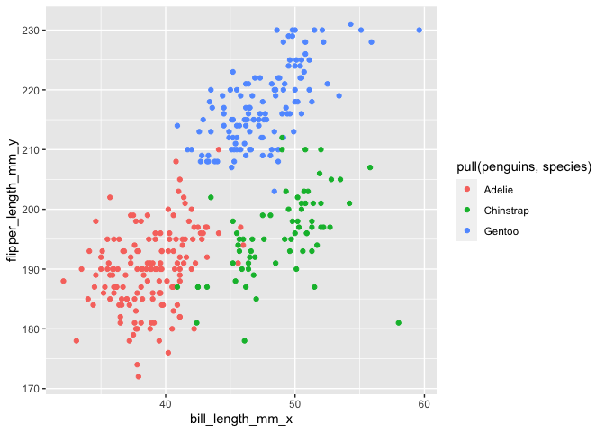

p8105_hw1_maf2311
================

# Problem 1

``` r
data("penguins", package = "palmerpenguins")
```

Penguins Dataset Description:

-   The Penguins dataset has the following variables: species, island,
    bill_length_mm, bill_depth_mm, flipper_length_mm, body_mass_g, sex,
    year. This data is from the year 2007 to 2009, and includes the
    following species of penguins: Adelie, Gentoo, Chinstrap.
-   The Penguins dataset has 344 rows and 8 columns.
-   The mean flipper length is 200.9152047 millimeters.

<!-- -->

    ## Warning: Removed 2 rows containing missing values (geom_point).

<!-- -->

    ## Warning: Removed 2 rows containing missing values (geom_point).

# Problem 2

This is my dataframe:

    ## # A tibble: 10 × 4
    ##    rand_samp vec_logical vec_char vec_factor
    ##        <dbl> <lgl>       <chr>    <fct>     
    ##  1     1.07  TRUE        D        a         
    ##  2    -2.14  FALSE       E        b         
    ##  3     1.50  TRUE        O        c         
    ##  4    -0.376 FALSE       I        a         
    ##  5     0.895 TRUE        N        b         
    ##  6    -0.224 FALSE       P        c         
    ##  7     0.582 TRUE        H        a         
    ##  8    -0.514 FALSE       M        b         
    ##  9     0.715 TRUE        Z        c         
    ## 10    -0.486 FALSE       L        a

I am able to take the mean of the rand_samp variable because it is an
integer, and I am able to take the mean of the logical variable because
it is binary, and are considered 0 = False, and 1 = True. I cannot take
the mean of a character variable or a factor variable.

``` r
as.numeric(pull(hw1_prob2_df, vec_logical))
as.numeric(pull(hw1_prob2_df,vec_char))
as.numeric(pull(hw1_prob2_df,vec_factor))
```

When I apply the as.numeric function, the logical, character, and factor
variables get assigned an integer, and then the mean can be calculated.
